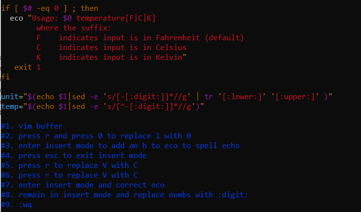
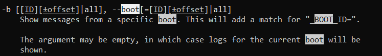
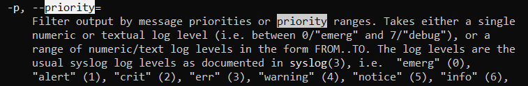
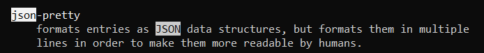
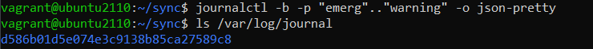

# Exam_2420
## Adrian Balcerak

## Step 1.

1. sudo apt update
2. sudo apt install

#Step 2.

1. vim buffer
2. press r and press 0 to replace 1 with 0
3. enter insert mode to add an h to eco to spell echo
4. press esc to exit insert mode
5. press r to replace V with C
6. press r to replace V with C
7. enter insert mode and correct eco
8. remain in insert mode and replace numbs with :digit:
9. :wq




#Step 3.

1. type /boot to search and press n navigate and find info
2. type /priority to search and press n and shift-n navigate and find info
3. type /json to search and find json-pretty and scroll up to find option






#Step 4.

1. useradd -ms /bin/bash bill
2. usermod -aG sudo bill
3. passwd bill
4. create script file and give exe permissions

```
#!/bin/bash

USERS=`grep "x:[1-4][0-9][0-9][0-9]" /etc/passwd`
echo "Regular users on the system are:\n ${USERS}"
CURRENTLY_LOGGED=`w | awk '{ print $1 }'`
echo "Currently logged in users are:\n${CURRENTLY_LOGGED}"
```

#Step 5.

```
#!/bin/bash

echo "hi bob"
```

move to /usr/bin

```
[Unit]
Description=runs a hi bob script

[Service]
type=simple
user=vagrants
RestartSec=10
ExecStart=/usr/bin/hi_bob
SyslogIdentifier=Diskutilization

[Install]
WantedBy=multi-user.target
```

move to /lib/systemd/system

Step 6.

```
OnBootSec=60
OnUnitActiveSec=60
```

